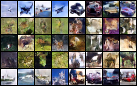

# Diffusion Model for CIFAR 10

In this repository, we explore the application of diffusion models on the CIFAR 10 dataset. The diffusion model is a deep learning technique used for generating samples that closely resemble a target data distribution. This repository particularly leverages architectures and insights from seminal works in the field.

- [Diffusion Model for CIFAR 10](#diffusion-model-for-cifar-10)
  - [Diffusion Model](#diffusion-model)
    - [Architecture Overview](#architecture-overview)
    - [References](#references)
  - [DDPM](#ddpm)
    - [Training Outputs](#training-outputs)
  - [Output](#output)

## Diffusion Model

The diffusion model is designed to simulate a random walk on the data manifold, iteratively refining its approximation of the target distribution. In our experiments, we specifically applied this approach to images from the CIFAR 10 dataset.

### Architecture Overview

Main Architecture

The main architecture of our diffusion model can be visualized below:

Unet Structure

Our model also incorporates a Unet structure, which allows for efficient and structured feature extraction:

### References

[Dhariwal, Nichol, 2021]

[Ho et al., 2020] Niels Rogge, Kashif Rasul's Huggingface notebook

## DDPM

The Denoising Diffusion Probabilistic Model (DDPM) is a state-of-the-art technique for generative modeling. By training a model to reverse a gradual noising process, DDPM can generate high-fidelity samples from the learned data distribution starting from random noise. For an in-depth understanding, refer to the original paper(https://arxiv.org/abs/2006.11239).

### Training Outputs
For visualization purposes, we present outputs from our trained model at various epochs:

## Output

Epoch 5:

Epoch 15:

Epoch 25:

Epoch 37:

